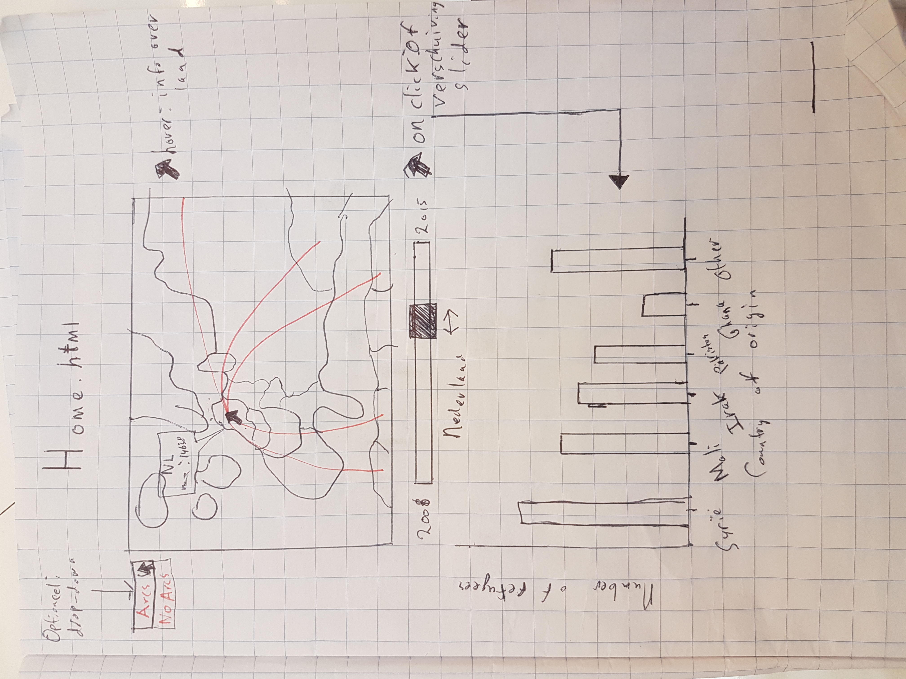
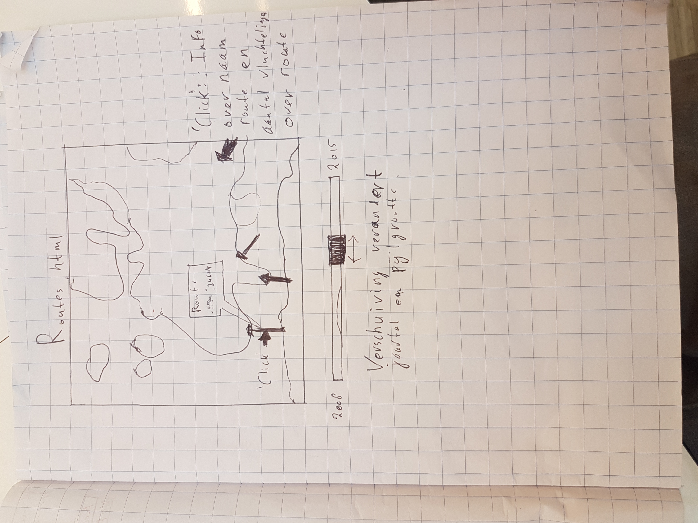
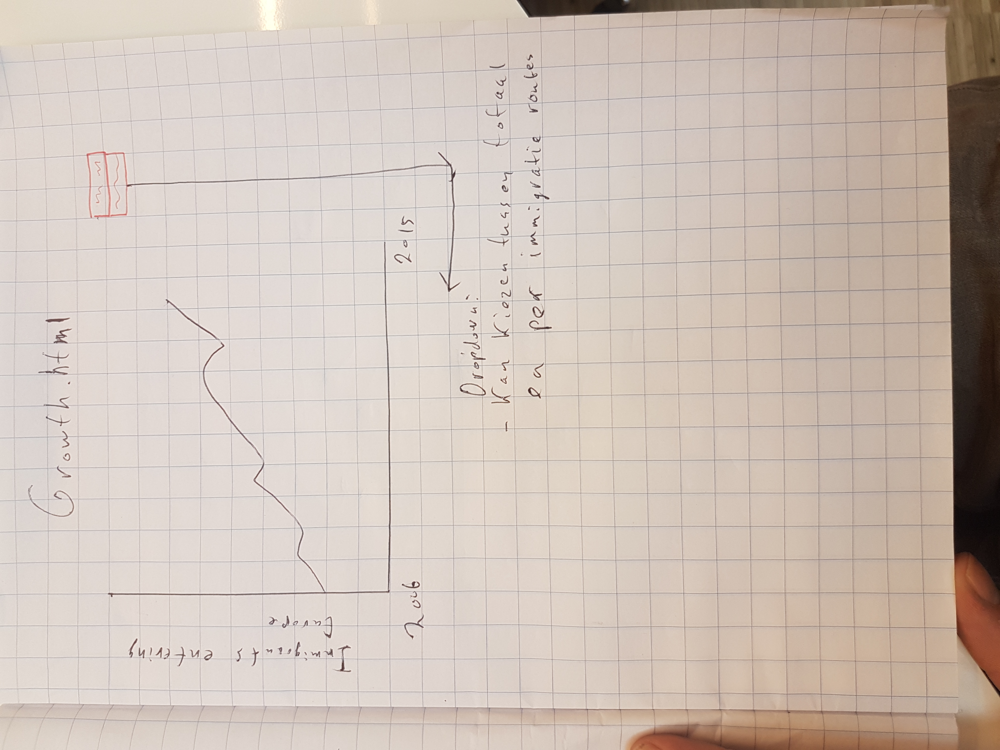

# day 3 
- Ik heb vandaag het design document afgemaakt en beter nagedacht over de aspecten van mijn website en visualisaties. Schetsen:

- Ik heb alvast een layout gemaakt voor de site waarop de visualisaties zullen staan.
- Ik heb alle data voor eerste dataset samengevoegd zodat ik er vervolgens een JSON object mee kan maken op dag 4.

# day 4
- Tweede dataset van Wikipedia gehaald en in een csv bestand gezet.
- JSON file gemaakt van de eerste dataset met handige structuur voor het werken in d3 met behulp van Python.
- Prototype afgemaakt van de website met behulp van CSS en HTML.
- JSON file gemaakt van de tweede dataset die ik wil gebruiken voor d3.

# day 5
- Datamap laten inzoomen op Europa
- Over alternatieve visualisaties nagedacht (op dit moment heb ik geen 3 visualisaties die gelinked zijn aan elkaar)
- Geprobeerd mijn JSON beter te formatten om te kunnen gebruiken met d3 (dit is mij vandaag niet gelukt en snap niet hoe ik het moet doen)

# weekend
- Dataset was niet goed voor mijn doeleinden (verkeerde definitie van vluchtelingen werd gehanteerd). Geprobeerd om juiste data te vinden. Jusite data gevonden. Ik ben er echter nog niet geslaagd om deze data in juiste JSON-format te zetten. De dataset bevat data over asielzoekers van 2006 totenmet 2016.

# day 6 (16 januari 2017)
- Dataset die ik in het weekend gevonden heb in juiste JSON-format gezet.
- Aan de hand van deze dataset tweede dataset gestructureerd die gebruikt kan worden voor het inkleuren van de datamap.
- Deze tweede dataset verbonden aan de datamap. Ook de slider heb ik al werkend gemaakt: Kleuren in de kaart worden geupdated aan de hand van het jaar dat op de slider gekozen is.
- Begin gemaakt aan het implementeren van de barchart.