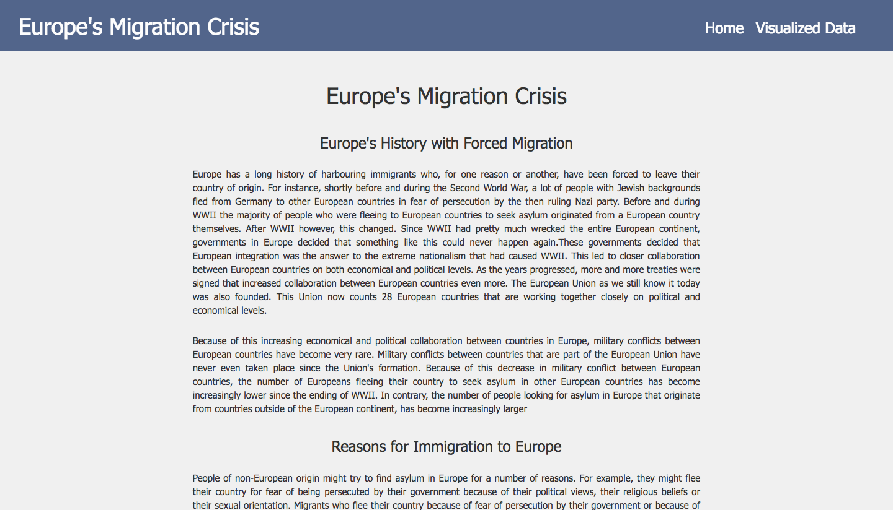
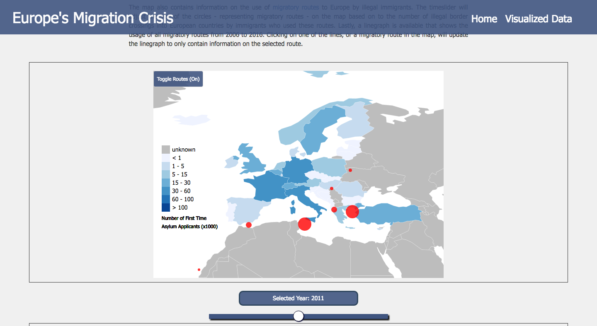
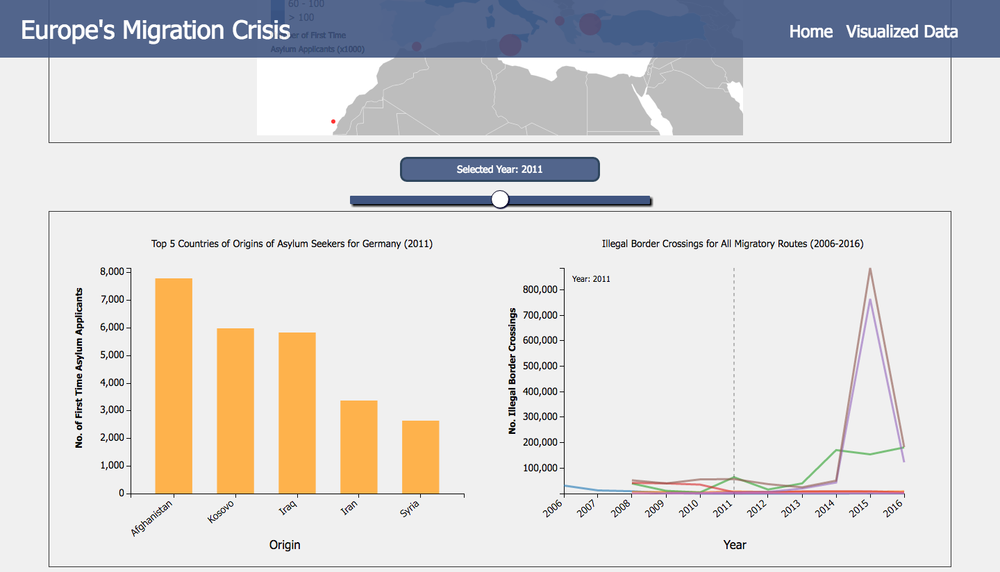

#Europe's Migration Crisis
####Tim Molleman

##Doel van het Project
Het project heeft als doel om gebruikers meer statistische informatie te verschaffen over immigratiestromen richting Europa tussen 2006 en 2016. Om dit doel te bereiken zijn er drie visualisaties gemaakt die aan elkaar verbonden zijn, namelijk een datamap, een barchart en een lijngrafiek.

##Het Probleem
In Europa is er sinds 2015 sprake van een grote stroom illegale immigranten - bestaande uit zowel vluchtelingen als gelukszoekers die zich voordoen als vluchtelingen - die een nieuw thuis proberen te vinden in Europese landen. Er is zelfs sprake van een ware migratiecrisis. Mede door deze crisis zijn er veel politieke spanningen ontstaan in veel Europese landen.
De visualisaties in mijn applicatie moeten gebruikers een duidelijker beeld geven over bepaalde aspecten van deze migratiecrisis. Hierdoor kunnen zij voor zichzelf een beter beeld krijgen over hoe groot het probleem nou daadwerkelijk is en kunnen ze beter geïnformeerde standpunten innemen over de migratiecrisis.

##Vormgeving en eigenschappen visualisaties
Hoe ga ik deze visualisaties vormgeven? Ik heb een website gemaakt met twee pagina's die allebei een eigen functie vervullen in het aanbieden van informatie over het migratieprobleem. Index.html bevat een stuk informatieve tekst die de visualisaties in data.html context geven. Hieronder staan foto's van de beide pagina's en staat er in meer detail uitgelegd wat er op de pagina's beschreven staat.

###Index.html:

Op deze pagina staat informatie over de geschiedenis van Europa ten aanzien van illegale immigratie en de Europese immigratiecrisis van 2015. De informatie wordt gegeven in5 paragrafen. Aan het einde is er nog een paragraaf die duidelijk maakt wat het doel is van de website/applicatie.

###Data.html

Op deze pagina staat nog een kleine paragraaf die de gebruiker uitlegt hoe de visualisaties werken en wat er in de visualisaties voor informatie aanwezig is. Ook staan de bronnen voor de data hier vermeld. De datamap op de pagina wordt dynamisch ingekleurd op basis van het aantal eerste asielzoekaanvragen een land ontvangen heeft voor een gegeven jaar. Dit jaar kan de gebruiker van de pagina gebruiken door de slider onder de kaart te bewegen. Wanneer een gebruiker zijn/haar muis over een land beweegt, verschijnt er in een tooltip informatie over het land en de data. Ook zijn op deze kaart cirkels aanwezig die illegale immigratieroutes richting Europa weergeven. Deze cirkels veranderen per jaar op de slider van grootte op basis van het aantal illegale grens oversteken dat er via de routes is gemaakt naar Europese landen om Europa binnen te komen. 

Onder de kaart is ook een barchart weergegeven. Deze bevat informatie over de top 5 (of meer) landen van herkomst waar voor een gegeven jaar de meeste asielzoekers vandaan zijn gekomen voor een gekozen Europees land. Wanneer de gebruiker op een land in de kaart klikt update de barchart om informatie voor dat land te laten zien voor het gegeven jaar. Als de timeslider vervolgens bewogen wordt update de barchart ook op basis van het jaar op de slider.

Ook is er onder de kaart nog een lijngrafiek. Hierin staan initieel 7 lijnen getekend die ieder de toename en/of afname in gebruik van een migratieroute tussen de jaren 2006-2016 weergeven. Wanneer de gebruiker op een cirkel in de kaart klikt of één van de lijnen aanklikt verandert de lijngrafiek. Deze geeft dan namelijk alleen nog de lijn weer voor de migratieroute die de gebruiker gekozen heeft. Een crosshair maakt het voor de gebruiker mogelijk om het gebruik van die route te zien voor het jaar waar hij/zij de muis bijhoudt. Een button naast de lijngrafiek maakt het voor de gebruiker vervolgens weer mogelijk om weer alle routes in de lijngrafiek weer te geven.

Hiernaast is er ook een button aanwezig bij de datamap die het mogelijk maakt om de visualisaties over migratieroutes te verbergen of weer te laten zien. Wanneer de gebruiker deze button indrukt om hem uit te zetten verdwijnen de cirkels en de lijngrafiek van de pagina.

##Data
Voor de hierboven beschreven visualizaties zijn twee datasets gebruikt. De eerste dataset bevat voor ieder Europees land informatie over het aantal asielzoekers dat tussen 2006-2016 voor het eerst een asielaanvraag heeft gedaan in dit land. Dit staat per land van herkomst in de dataset aanwezig. De tweede dataset bevat informatie over het aantal illegale grensoversteken per migratieroute tussen de jaren 2006 en 2016. Datasets zijn in Python omgezet naar twee aparte JSON-files.

### Datasets
Ik heb twee datasets gebruikt en heb deze van de volgende bronnen.
* Voor de refstreams.json dataset heb ik de tabel onder het kopje 'Migrant routes, development, and responses in individual countries' gebruikt op https://en.wikipedia.org/wiki/European_migrant_crisis. De originele data komt van Frontex.
* Voor de migrants.json dataset heb ik een csv gevonden op http://popstats.unhcr.org/en/asylum_seekers_monthly.

## Externe Bronnen 
###Gebruikte Foto's voor Slider
* http://www.economonitor.com/wp-content/uploads/2016/04/wee-migrants_3481243b.jpg
* http://www.euractiv.com/wp-content/uploads/sites/2/2015/08/europe-migrant-boat-disaster.jpeg
* http://static4.businessinsider.com/image/55def251bd86ef1f008b638e-2200-1529/rtx1pocf.jpg
* http://images.catchnews.com/uploads/images/2015/09/05/european-refugee-crisis-embed4.jpg

### Externe Code
De volgende externe files bevatten licenties en copyright.
* Javascript en CSS voor de blueberry slider. Copyright: 2011, Mark Tyrrell. Link: https://github.com/marktuk/Blueberry
* jquery v1.6.1., nodig voor gebruik blueberry slider. Copyright: 2011, the Dojo Foundation. Link: https://ajax.googleapis.com/ajax/libs/jquery/1.6.1/jquery.min.js
* jquery v3.1.1., nodig om bootstrap te kunnen gebruiken. Copyright: JS Foundation and other contributors. Link: https://code.jquery.com/jquery-3.1.1.js
* Bootstrap v3.3.7., voor de opmaak van de pagina. Copyright: 2011-2017, Twitter Inc., copyright: 2011-2017, the Bootstrap Authors. 
Javascript: https://maxcdn.bootstrapcdn.com/bootstrap/3.3.7/js/bootstrap.min.js
CSS: 
* d3.v3.min.js, voor d3. Copyright: 2010-2016, Mike Bostock. Link: https://github.com/d3/d3 en https://d3js.org/
* topojson.v1.min.js, voor maken kaart. Copyright: 2012-2016, Mike Bostock. Link: https://github.com/topojson/topojson-client en https://d3js.org/topojson.v1.min.js
* d3-queue.v3.min.js, voor inladen json-files. Copyright: 2016, Mike Bostock. Link: https://d3js.org/d3-queue.v3.min.js
* datamaps.world.min.js?v=1, voor het creeëren van datamap. Copyright: 2012, Mark DiMarco. Link: https://datamaps.github.io/scripts/datamaps.world.min.js?v=1

