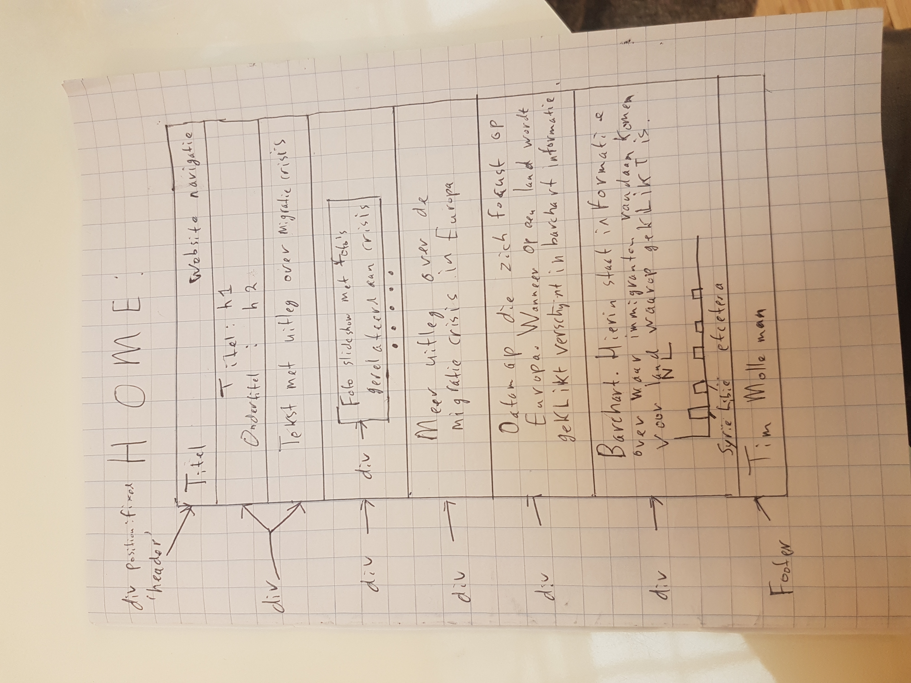
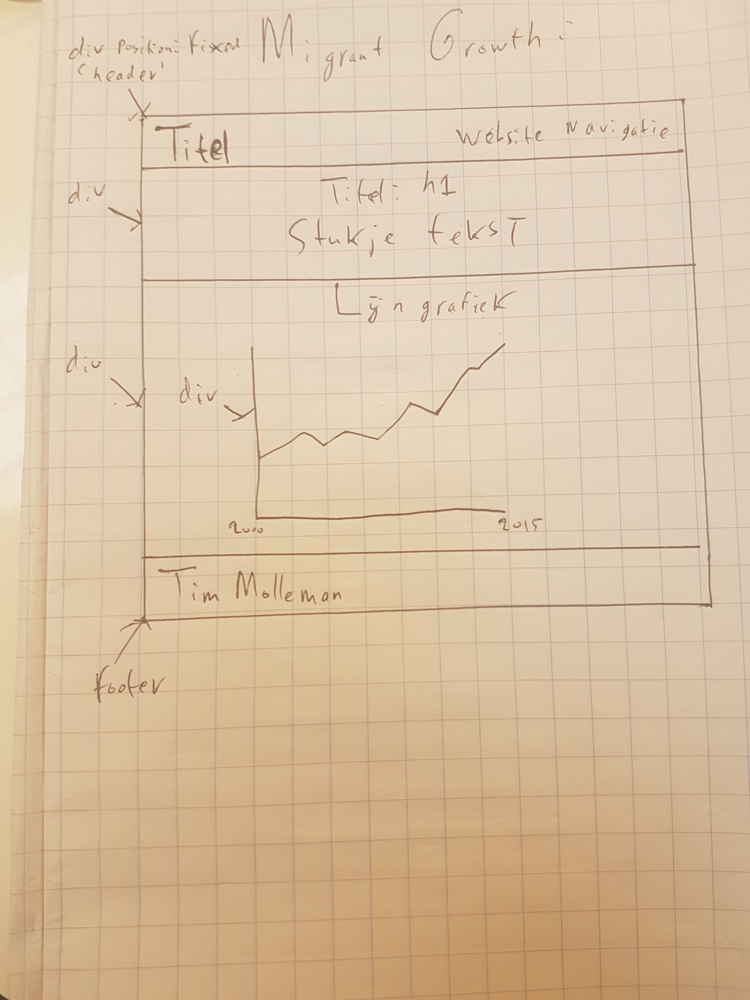

#Programmeerproject voorstel
####Tim Molleman

##Doel van het Project
Het project heeft als doel om gebruikers meer statistische informatie te verschaffen over immigratiestromen richting Europa. Om dit doel te bereiken zijn er drie visualisaties gemaakt die aan elkaar verbonden zijn, namelijk een datamap, een barchart en een lijngrafiek.

##Het Probleem
In Europa is er sinds 2015 sprake van een grote stroom illegale immigranten - bestaande uit zowel vluchtelingen als gelukszoekers die zich voordoen als vluchtelingen - die een nieuw thuis proberen te vinden in Europese landen. Er is zelfs sprake van een ware migratiecrisis. Mede door deze crisis zijn er veel politieke spanningen ontstaan in veel Europese landen.
De visualisaties in mijn applicatie moeten gebruikers een duidelijker beeld geven over bepaalde aspecten van deze migratiecrisis. Hierdoor kunnen zij voor zichzelf een beter beeld krijgen over hoe groot het probleem nou daadwerkelijk is en kunnen ze beter geïnformeerde standpunten innemen over de migratiecrisis.

##Vormgeving en eigenschappen visualisaties
Hoe ga ik deze visualisaties vormgeven? Ik wil een website maken met twee pagina's die allebei een eigen functie vervullen in het aanbieden van informatie over het migratieprobleem. Index.html zal een stuk informatieve tekst bevatten die de visualisaties in data.html
Hiervoor zal ik waarschijnlijk 3 webpagina's gebruiken, met als titels: 'Home', 'Migration Routes' en 'Migrant Growth'. Ik zal hieronder een schets laten zien voor elke pagina en uitleg geven over deze pagina.

###Home:

Op de 'Home'-pagina zal ik ten eerste een uitleg geven over de Europese migratiecrisis aan de hand van twee paragrafen. Tussen deze twee paragrafen laat ik nog een automatische slideshow lopen die foto's laat zien die gerelateerd zijn aan de Europese migratiecrisis. Onder deze uitleg zal er vervolgens een datamap aanwezig zijn die is 'gefocust' op Europa. De (Europese) landen op deze kaart zullen ingekleurd zijn met één kleur met verschillende (bijvoorbeeld vijf) tinten. Hierbij zal een lichtere kleurentint betekenen dat een bepaald land minder vluchtelingen heeft opgenomen en een donkerdere kleur zal betekenen dat een bepaald land meer vluchtelingen heeft opgenomen. Mijn idee is om onder de datamap een 'slider' toe te voegen die ervoor zorgt dat gebruikers voor verschillende jaren kunnen kijken hoeveel immigranten ieder Europees land voor het gekozen jaar (op de slider) heeft opgenomen. Dit kan bijvoorbeeld voor de jaren 2000 totenmet 2015, waarbij ieder tussenliggend jaar geselecteerd kan worden op de slider. De kleurentinten van landen op de kaart zullen bij verschuiving van de slider dan veranderen op basis van het aantal immigranten dat landen in het gekozen jaar hebben opgenomen. Wanneer de gebruiker met de muis over een land heen gaat, wil ik dat het aantal immigranten dat het land dat jaar heeft opgenomen zichtbaar wordt in een tooltip (en natuurlijk ook de naam van het land). 
Een optie die ik wellicht ook nog wil implementeren is dat het mogelijk is om lijnen/bogen te laten verschijnen wanneer er op een land geklikt wordt (aan de hand van bijvoorbeeld een button). Deze bogen zouden dan van dit land naar een aantal andere landen (bijv. 5 landen) gaan waar de meeste immigranten vandaan komen die het land heeft opgenomen waarop geklikt is. Wellicht wil ik naast deze bogen dan ook nog het aantal immigranten uit ieder van deze landen melden.

Wanneer er op een land geklikt wordt in de hierboven beschreven datamap wil ik hiernaast dat er onder de datamap een barchart verschijnt die voor dit land (en voor het specifieke jaar) laat zien waar de immigranten die het land heeft opgenomen vandaan kwamen. Het ligt aan de data of ik hier voor ieder land waar immigranten vandaan komen een barchart laat zien of dat ik alleen data laat zien van bijvoorbeeld de 5 landen waar het grootste aantal immigranten vandaan komen. Als een land bijvoorbeeld immigranten heeft opgenomen uit 40 landen, waarvan uit heel veel van deze landen maar enkele mensen, dan wordt de barchart misschien enigszins onoverzichtelijk.

Bovenaan de 'Home'-pagina zal een header aanwezig zijn die 'fixed' gepositioneerd is en dus meebeweegt over de hele pagina. In deze header zal een titel staan en een navigatiemenu waarmee de gebruiker naar de verschillende pagina's op de website kan navigeren. Deze header is overigens ook aanwezig op de andere pagina's van de website.

###Migration Routes

Op de 'Migration Routes'-pagina zal ik eerst een korte uitleg geven over migratieroutes naar Europa. Er zijn namelijk verschillende veelgebruikte routes die immigranten gebruiken om naar Europa te komen. Onder deze uitleg staat wederom een datamap. Deze keer staat er geen informatie over het aantal immigranten dat ieder land opneemt, maar staat er hoeveel immigranten er via verschillende routes Europa binnenkomen. Deze routes wil ik aangeven aan de hand van cirkels (zie foto hierboven) of - als dit mogelijk is - aan de hand van pijlen. De grootte van de cirkels/pijlen geven dan aan hoeveel immigranten er via een bepaalde route Europa binnenkomen. Ook hier wil ik weer een slider toevoegen waarmee de gebruiker een jaar kan kiezen. De cirkels/pijlen zullen voor ieder jaar veranderen van grootte, aan de hand van de hoeveelheid immigranten dat via de verschillende routes Europa binnen is gekomen.

###Migrant Growth

Op de 'Migrant Growth'-pagina zal ik een lijngrafiek toevoegen die laat zien hoeveel immigranten er in totaal in Europa zijn binnengekomen over een spanne van een aantal jaren (wederom, bijvoorbeeld 2000-2015). Ook wil ik aan deze lijn een tooltip toevoegen die het aantal immigranten laat zien voor een bepaald jaar (afhankelijk van muispositie). Wellicht wil ik bij de lijngrafiek ook nog een optie toevoegen die ervoor zorgt dat men over dit aantal jaren kan zien via welke migratieroutes immigranten naar Europa kwamen, door voor iedere immigratieroute een lijn te laten zien in de lijngrafiek.

##Data
Voor de hierboven beschreven visualizaties zal ik waarschijnlijk verschillende datasets nodig hebben. Ik heb sowieso voor ieder Europees land informatie nodig over het totaal aantal immigranten dat dit land heeft opgenomen.Hiernaast heb ik voor ieder land ook informatie nodig over uit welke landen deze immigranten zijn gekomen + de aantallen die uit deze landen zijn gekomen. Preferabel heb ik hierover informatie van ongeveer 2000/2005 totenmet 2015 (en het liefst zelfs 2016). Hiernaast zal ik ook een dataset nodig hebben die informatie bevat over het aantal immigranten dat via verschillende routes Europa binnen is gekomen. Deze informatie heb ik vooral nodig van de laatste jaren, aangezien de migrantencrisis voornamelijk in de laatste jaren is ontstaan. Alle data wil ik in JSON format zetten door Python te gebruiken. Vervolgens wil ik deze JSON data inladen in een javascript bestand. JSON maakt het in Javascript namelijk makkelijk om met de data te werken.

##API'S?
Op dit moment weet ik nog niet wat voor API'S ik allemaal nodig ga hebben. Ik weet alleen dat ik D3 zal moeten gebruiken voor de datamaps en dat ik D3 ook zal gebruiken voor de andere beoogde visualizaties in mijn project. Ook heb ik gezien dat er API'S zijn die het mogelijk maken om makkelijk een automatische slideshow (zie 'Home'-pagina stukje) te implementeren. Hier zal ik dus ook naar zoeken. 

##Mogelijke Technische Problemen
Ik heb op dit moment ook nog nauwelijks oog op wat voor technische problemen ik wellicht tegen ga komen tijdens dit project. In principe ben ik al bekend met datamaps en heb ik al eens lijngrafieken en barcharts gemaakt. Ik heb echter nog nooit een slider toegepast op een datamap, bogen toegevoegd aan een datamap en cirkels/pijlen toegevoegd aan een datamap. Deze dingen zouden dus nog wel even pittig kunnen worden voor mij.

##Minimum Viable Product
Enkele van deze dingen zou ik echter pas later kunnen proberen toe te passen, als blijkt dat ik nog genoeg tijd heb. 
Daarvoor wil ik sowieso de volgende dingen goed werkend hebben (MVP):
- Barchart en datamap op de home pagina interacteren naar behoren.
- De sliders voor de datamaps op zowel de home pagina als de migration routes pagina functioneren naar behoren.
- De datamap op de migration routes pagina is compleet (waarschijnlijk met cirkels, wellicht pijlen).
- De lijngrafiek op de migrant growth pagina laat groei van immigranten in Europa zien in één lijn
- Layout van de gehele site is naar behoren

Dingen die ik nog zou kunnen toevoegen als er tijd is (optioneel):
- In de barchart op de homepagina bogen die aangeven uit welke (top 5) landen immigranten komen voor een land waarop geklikt wordt. Wellicht nog het aantal immigranten dat uit deze landen komt naast de bogen.
- In de lijngrafiek op de migrant growth pagina een drop-down menu toevoegen, zodat de gebruiker meerdere lijnen te zien krijgt voor het gebruik van de verschillende migratieroutes in Europa door immigranten, over de jaren heen.
- Wellicht sla ik ofwel de tweede datamap, ofwel de lijngrafiek over, wanneer blijkt dat implementatie van beiden onhaalbaar is. Ik kan dit op het moment voor mezelf nog niet heel goed inschatten.

##Gelijkmatige implementaties
Er zijn op het web al best veel visualizaties te vinden om meer over de migratiecrisis duidelijk te maken. Zij gebruiken vaak barcharts om aantallen weer te geven, en kaarten in combinatie met pijlen om migratieroutes weer te geven.

# Laatste Readme Shizzle
####Tim Molleman

## Externe Bronnen 
###Gebruikte Foto's voor Slider
* http://www.economonitor.com/wp-content/uploads/2016/04/wee-migrants_3481243b.jpg
* http://www.euractiv.com/wp-content/uploads/sites/2/2015/08/europe-migrant-boat-disaster.jpeg
* http://static4.businessinsider.com/image/55def251bd86ef1f008b638e-2200-1529/rtx1pocf.jpg
* http://images.catchnews.com/uploads/images/2015/09/05/european-refugee-crisis-embed4.jpg

### Externe Code
De volgende externe files bevatten licenties en copyright.
* Javascript en CSS voor de blueberry slider. Copyright: 2011, Mark Tyrrell. Link: https://github.com/marktuk/Blueberry
* jquery v1.6.1., nodig voor gebruik blueberry slider. Copyright: 2011, the Dojo Foundation. Link: https://ajax.googleapis.com/ajax/libs/jquery/1.6.1/jquery.min.js
* jquery v3.1.1., nodig om bootstrap te kunnen gebruiken. Copyright: JS Foundation and other contributors. Link: https://code.jquery.com/jquery-3.1.1.js
* Bootstrap v3.3.7., voor de opmaak van de pagina. Copyright: 2011-2017, Twitter Inc., copyright: 2011-2017, the Bootstrap Authors. 
Javascript: https://maxcdn.bootstrapcdn.com/bootstrap/3.3.7/js/bootstrap.min.js
CSS: 
* d3.v3.min.js, voor d3. Copyright: 2010-2016, Mike Bostock. Link: https://github.com/d3/d3 en https://d3js.org/
* topojson.v1.min.js, voor maken kaart. Copyright: 2012-2016, Mike Bostock. Link: https://github.com/topojson/topojson-client en https://d3js.org/topojson.v1.min.js
* d3-queue.v3.min.js, voor inladen json-files. Copyright: 2016, Mike Bostock. Link: https://d3js.org/d3-queue.v3.min.js
* datamaps.world.min.js?v=1, voor het creeëren van datamap. Copyright: 2012, Mark DiMarco. Link: https://datamaps.github.io/scripts/datamaps.world.min.js?v=1

### Datasets
Ik heb twee datasets gebruikt en heb deze van de volgende bronnen.
* Voor de refstreams.json dataset heb ik de tabel onder het kopje 'Migrant routes, development, and responses in individual countries' gebruikt op 

