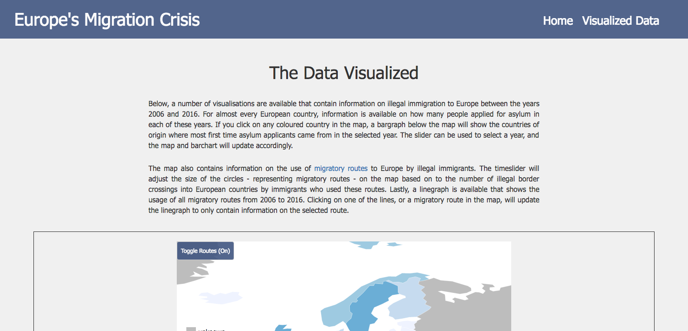

# EindVerslag
###Tim Molleman

## Overzicht Applicatie
In mijn applicatie bied ik gebruikers informatie over - voornamelijk illegale - migratiestromen naar Europese landen vanuit landen buiten Europa. De applicatie bevat informatie van de jaren 2006 tot en met 2016. De eerste html-pagina van de applicatie bevat tekstuele informatie over illegale immigratie naar Europa en het doel van de applicatie. Dit doel wordt verwezenlijkt door drie visualisaties die op de tweede html-pagina beschikbaar zijn. De eerste visualisatie is een datamap die update aan de hand van een timeslider met de jaren 2006-2016 erop. In de datamap wordt ieder land ingekleurd aan de hand van hoeveel mensen voor het eerst een asielaanvraag hebben gedaan in deze landen in het jaar op de timeslider. Hiernaast zijn er op de datamap cirkels aanwezig die migratieroutes richting Europa aangeven. De grootte van iedere cirkel wordt bepaald door het aantal illegale grens oversteken dat er via die route gemaakt is naar een Europees land om Europa binnen te komen.

De datamap is verbonden aan twee andere visualisaties. Wanneer een gebruiker op een land klikt waar data over is, verschijnt er ten eerste een barchart die voor het aangeklikte land de top 5 (of meer) landen van herkomst laat zien van 'first-time' asielaanvragers. Ook het aantal asielaanvragen voor ieder van deze landen van herkomst is hier te zien. De barchart update ook wanneer de timeslider beweegt. Hiernaast is er een lijngrafiek aanwezig die het gebruik van de migratieroutes laat zien van de jaren 2006-2016. Iedere migratieroute wordt weergegeven als een lijn in deze grafiek. Wanneer een gebruiker één van de lijnen aanklikt of een cirkel in de kaart aanklikt, update de lijngrafiek zodat deze alleen nog een lijn laat zien voor de geselecteerde migratieroute.

Naast de slider is er nog een knop aanwezig die het mogelijk maakt om de routes aan of uit te zetten (routes-toggle button). Ook is er een knop die het voor de gebruiker mogelijk maakt weer alle migratieroutes in de lijngrafiek te weergeven in plaats van slechts 1 lijn voor één route (lines-toggle button).

## Technisch Design
### De inrichting van de code
In tegenstelling tot mijn initiële design wordt er bijna uitsluitend Javascript gebruikt voor 'data.html'. De uitzondering is de Javascript die gebruikt wordt voor de Blueberry foto slideshow in 'index.html'. Hiervoor wordt een Javascript file genaamd 'jquery.blueberry.js' opgeroepen in de html en ook jquery versie 1.6.1. (anders werkt jquery.blueberry.js niet). Het kleine stukje jquery-code in data.html zorgt er vervolgens voor dat de blueberry slider functioneel is. 

De rest van de Javascript files zijn allemaal enkel en alleen verbonden aan data.html. Ik heb ieder 'blok' van functionaliteit een eigen Javascript file gegeven zodat de code in zijn geheel overzichtelijk blijft. Beschrijving van functies Javascript files:

#### index.js:
Deze js-file is in essentie de file waarin alle functies uit de js-files die hieronder nog worden beschreven samen worden gevoegd om de functionaliteit (en ook een deel van de css) van de pagina te implementeren. De kaart (inclusief cirkels), barchart en lijngrafiek worden hier geïnitialiseerd. Hiernaast is er een eventlistener verbonden aan de slider. Wanneer de waarde van de timeslider verandert worden de kaart, de barchart en de lijngrafiek geupdated vor het jaar op de slider. Functies in hieronder beschreven javascript files worden dan aangeroepen. Ook is er een eventlistener verbonden aan alle landen op de kaart. Wanneer er op een land geklikt wordt waar data van beschikbaar is wordt de barchart geupdated om bars te laten zien voor dat land voor het jaar op de slider. Ook zijn hier twee functies die verbonden zijn aan de buttons. Één functie zorgt dat de routes in en uitgeschakeld kunnen worden en de andere zorgt ervoor dat er teruggeschakeld kan worden van een lijngrafiek die slechts één vluchtelingenroute weergeeft naar een lijngrafiek die alle vluchtelingenroutes bevat.

#### data.js:
Deze js-file bevat functies die gebruikt worden om op wat voor manier dan ook data te manipuleren, alsmede om nieuwe datasets te creeëren op basis van de twee originele datasets ("migrants.json" en "refstreams.json"). Deze data wordt dan weer gebruikt in de onderstaande js-files waar functies in staan voor het maken van de visualisaties. 
* findCountry wordt gebruikt om data van het juiste land op te slaan voor het maken van de barchart (wordt aangeroepen in bar.js 'createBarchart').
* storeRefugees wordt gebruikt om van een land dat gevonden is met findCountry de top 5 (of meer) landen van herkomst te vinden voor het maken van de barchart (ook aangeroepn in bar.js).
* findRoute wordt gebruikt om een migratieroute lijn op te laten lichten of te tekenen waarop geklikt wordt in de datamap (aangeroepen in line.js). Het heeft als argument een getransformeerde refstreams.json dataset (transformatie vindt plaats in transformRefstreams functie).
* getFillKey is een functie die gebruikt wordt om de kleur van een land te bepalen bij het maken van de datamap of het updaten van de kleuren.
* getRadius bepaald de grootte van cirkels op de kaart aan de hand van het aantal grens oversteken. Deze wordt aangeroepen in circles.js.
* currentData vindt de data in de migrants.json dataset voor het jaar op de slider. Functie wordt aangeroepen om data voor juiste jaar te selecteren in map.js en bar.js wanneer de slider verschuift. 
* createFillData wordt gebruikt om data naar format om te zetten dat datamap accepteert voor het inkleuren van landen. getFillKey wordt hier aangeroepen om de fillkey van ieder land te bepalen. De functie heeft als argument een dataset die gemaakt is met de currentData functie. Wordt aangeroepen in map.js functies.
* transformRefstreams wordt gebruikt om de data uit de refstreams.json naar een bruikbaar formaat om te zetten.
* numberWithCommas zet numerieke waarden om naar deze waarde met comma's voor iedere drie nummers (800000 wordt 800,000)

#### map.js
Deze js-file bevat drie functies voor het maken en updaten van de map. 
* createMap maakt de datamap aan. Neemt als argumenten het huidige jaar op de slider alsmede een dataset gecreeërd met currentData (data.js)
* updateMap verandert de kleuren van de landen op basis van het aantal asielzoekers voor een gegeven jaar. Heeft dezelfde argumenten als createMap
* createLegend maakt een legenda aan voor de datamap. Functie wordt aangeroepen in createMap

#### circles.js
Deze js-file bevat functies voor het maken en verwijderen van cirkels op de kaart. 
* drawCircles creeërt cirkels op de kaart. Wordt aangeroepen bij laden van de  pagina, wanneer routes-toggle migratieroutes 'aangezet' wordt en wanneer het jaar op de slider verandert. Neemt als argument dataset gemaakt met transformRefstreams.
* eraseCircles wordt gebruikt wanneer de routes-toggle migratieroutes uit wordt gezet. Verwijdert de cirkels van de kaart.

#### bar.js
Deze js-file bevat slechts één functie, 'createBarchart', die een barchart aanmaakt voor een land waarop geklikt wordt/us voor het gegeven jaar op de slider. De functie wordt aangeroepen in index.js wanneer er op een land in de kaart geklikt wordt of wanneer er een verandering van jaartal op de slider waargenomen wordt (waargenomen door de eventlisteners).  

#### line.js
Deze js-file bevat 5 functies voor het maken van de lijngrafieken. 
* De createLine functie wordt gebruikt om een lijngrafiek te creeëren die lijnen bevat voor iedere migratieroute op de kaart. Functie wordt in index.js aangeroepen wanneer pagina geladen wordt. Ook wanneer de routes-toggle button 'aan' wordt gezet, wordt deze functie aangeroepen. 
* De createLine2 functie wordt gebruikt om een lijngrafiek te creeëren die één lijn bevat voor een geselecteerde vluchtelingenroute. Wordt aangeroepen wanneer een 'on click' event plaatsvindt op de cirkels in de kaart alsmede op één van de lijnen in de lijngrafiek die alle routes bevat. 
# De dotLine functie wordt aangeroepen in createLine2 om een crosshair te maken die centreert op een stip die bijhoudt op welk jaar de muis staat in de lijngrafiek en. Laat ook de waarde zien voor dat jaar, linksboven in de hoek van de grafiek.
* De trackLine functie is een functie die in dotLine wordt aangeroepen om bij te houden welk jaar op dat moment op de slider staat. De waarde van het jaar staat linksbovenin de lijngrafiek weergegeven en verandert dus wanneer de slider verschuift. Wanneer de lijngrafiek alle lijnen bevat, voegt deze functie een trackline aan de grafiek toe die duidelijk maakt welk jaar er op de slider staat.
* removeLinegraph wordt aangeroepen wanneer de routes-toggle button aangeklikt wordt om de routes te verwijderen. Welke lijngrafiek er dan ook aanwezig is; deze wordt geselecteerd en verwijdert van de pagina.
* Enkele andere functies zijn nog aanwezig die gebruikt worden voor het maken van het canvas, het toevoegen van de assen en titel aan het canvas, en soortgelijke kleine  functionaliteiten.

### Ontwikkeling en Keuzes
Initieel was het mijn plan om in mijn applicatie drie html-pagina's te gebruiken en vier visualisaties toe te passen. Op de eerste pagina ('index.html') zou een datamap komen en daarbij ook de barchart. Deze zouden aan elkaar gelinkt zijn zoals ook beschreven onder het kopje 'Overzicht Applicatie'. De tweede pagina ('routes.html') zou een datamap bevatten met cirkels die migratieroutes zouden weergeven. De derde pagina ('growth.html') zou een lijngrafiek bevatten met een lijn die de groei van illegale migratie naar Europa zou weergeven tussen 2006 en 2016. Een drop-down menu met alle migratieroutes zou het vervolgens mogelijk maken om eenzelfde lijn te weergeven, maar dan voor één geselecteerde migratieroute in het menu.

Uiteindelijk is mijn design veel anders geworden. In mijn initiële plan was er namelijk geen sprake van drie gelinkte visualisaties (een vereiste voor de opdracht). Door slechts twee html-pagina's te gebruiken - één voor uitleg en één voor de visualisaties - is de applicatie nu een stuk overzichtelijker en coherenter. 

### Uitdagingen en Oplossingen
####Bargraph
Een probleem dat ik tegenkwam met betrekking tot het implementeren van de barchart, is dat het soms zo was dat er in sommige landen in bepaalde jaren geen top 5 landen van herkomsten van asielaanvragers aanwezig waren. Dit kwam doordat er van sommige landen van herkomst in de top 5 eenzelfde aantal asielaanvragers het aangeklikte land binnengekomen waren. Dit betekent dat het mogelijk was voor een land van herkomst om niet in de bargraph te komen, terwijl uit dit land wel eenzelfde aantal asielzoekers naar het aangeklikte land waren gekomen voor het gegeven jaar als een ander land in de bargraph. In dit geval werd er vaak maar 1 arbitrair gekozen land van herkomst met dit aantal asielzoekers weergegeven in de bargraph. 

Ik heb ervoor gekozen dat wanneer dit het geval was, alle landen van herkomst met eenzelfde aantal asielzoekers in de barchart weer te geven (dit dus wanneer zij in de top 5 waarden van asielaanvragers stonden). Hierdoor werd er geen arbitraire keuze meer gemaakt met betrekking tot welke landen er geïncludeerd werden. Gezien de bars in mijn barchart eerst een vastgestelde grootte hadden, werd het gehele barchart element al snel veel breder wanneer het bovenstaande probleem optreedde. Eerst heb ik dit geprobeerd op te lossen door CSS 'overflow' - waarbij je door de barchart heen kon scrollen - te gebruiken wanneer de barchart te breed werd, maar het bleek uiteindelijk onintuïtief voor gebruikers dat je kon scrollen door de barchart. Ik heb er daarom voor gekozen om de breedtes van de bars te bepalen aan de hand van het aantal landen van herkomst op de x-as. Dit werkt nu goed.

####Lijngrafiek
Bij het implementern van de lijngrafiek kwam ik ook een probleem tegen. Initieel had ik besloten om alleen een lijngrafiek te maken die lijnen liet zien voor iedere migratieroute. Door een extreme waarde van ongeveer 900.000 illegale grensoversteken in 2015 bij een bepaalde route viel van vele lijnen echter niet meer goed het verloop af te lezen, aangezien het maximaal aantal illegale grensoversteken per jaar tussen de jaren 2006-2016 voor bijna alle routes onder de 150.000 bleef. Hierdoor werd de onderkant van de lijngrafiek heel 'druk' en onoverzichtelijk. 

Om dit probleem op te lossen heb ik ervoor gekozen de lijngrafiek wel te behouden, maar er ook voor te kiezen dat gebruikers een lijngrafiek konden zien van iedere route op zich, door op een route in de eerste lijngrafiek te klikken of door op een cirkel in de kaart te klikken. Door de routes-toggle button konden zij weer terug naar de lijngrafiek met alle migratieroutes erin.

####Datamap
Ik heb bij het implementeren van de datamap de twee ideeën voor de datamaps in het DESIGN.md document in één datamap samengevoegd. Het enige probleem dat ik hierbij tegenkwam, was dat ik mijn data toch iets anders moest formatten dan ik origineel gedacht had. Om de kaart in te kleuren heb ik de objecten in een array gesorteerd op basis van jaar in plaats van op basis van land. Hierdoor was de data veel makkelijker te binden aan de slider. Het dataformat voor het toevoegen van de migratieroute-cirkels heb ik wel praktisch hetzelfde gelaten (per route een object en vervolgens de jaren en waarden). Met een toggle is het mogelijk om de cirkels voor de route uit te schakelen. Ik heb ervoor gekozen om geen bogen te implementeren in de Datamap. Dit gezien de positie van vele herkomstlanden buiten de 'scope' van de datamap vielen. De kaart was namelijk gecentreerd op Europa.

###Verantwoording voor Uiteindelijke Versie
De uiteindelijke versie is een stuk overzichtelijker dan het originele idee. Hiernaast zijn nu alle visualisaties gelinkt, iets wat niet zo was bij het originele idee. Het de gebruiker mogelijk maken om zowel alle routes te zien in een lijngrafiek als aparte routes is ook een verbetering. De grafiek met alle routes biedt een globaal overzicht, en wanneer de gebruiker geïnteresseerd is in een specifieke route kan hij/zij deze route simpelweg aanklikken. Het toevoegen van de informatiepagina geeft de gebruiker hiernaast direct informatie over de migratiecrisis en het doel van de applicatie alvorens naar de kern van de applicatie (de visualisaties) te verwijzen. Hoewel ik eerst dacht dat het samenvoegen van de twee originele ideeën voor de twee originele datamaps in één datamap deze datamap onoverzichtelijk zou maken, valt dit uiteindelijk reuze mee. De cirkels zijn over het algemeen niet groot genoeg om hele landen te bestaan. Ook kan de gebruiker er nog voor kiezen om de cirkels te verwijderen als hij/zij deze toch onoverzichtelijk vindt. Hiernaast biedt het samenvoegen van deze ideeën voor visualisaties de gebruiker zelfs meer informatie dan bij het originele design. De gebruiker ziet namelijk in één oogopslag de samenhang tussen het aantal illegale grensoversteken naar Europese landen en de groei van asielaanvragen in Europese landen. Als ik nog meer tijd had, zou ik het mogelijk maken voor de gebruiker om de kaart naar een wereldniveau uit te zoomen, zodat ik bogen kon toevoegen van Europese landen naar de herkomstlanden van asielzoekers. Voor de rest ben ik tevreden met het veranderen van mijn designkeuzes en de daadwerkelijke implementatie van deze keuzes.

###Noot
Codehub gaf mijn repository een 5 met externe (niet zelf geschreven) code erin. Zonder externe code gaf Codehub een 7.

